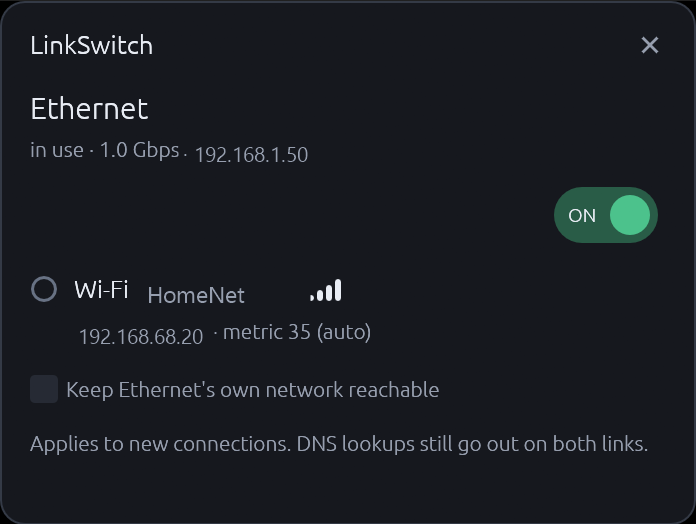

# LinkSwitch

Choose whether Windows sends your traffic over **Ethernet** or **Wi-Fi** — without unplugging the cable.



## The problem

Plug in an Ethernet cable and Wi-Fi stops being used. Not because it disconnected — it's still
associated, still showing full bars — it just quietly loses.

Two separate things cause this, and most advice only mentions the first:

1. **Routing.** Windows picks an outbound interface by longest-prefix match, then by the lowest
   *total metric* (route metric + interface metric). It assigns those metrics automatically from
   link speed. On the machine this was built on, Ethernet gets **5** and Wi-Fi gets **30**, so the
   moment the cable goes in, Ethernet wins every new connection.

2. **Association.** Windows Connection Manager's *"minimize the number of simultaneous connections"*
   policy is **on by default**, and it blocks Wi-Fi from *auto*-connecting whenever a preferred
   network type — Ethernet — is already up. So after a reboot with the cable in, Wi-Fi may not come
   back at all.

LinkSwitch handles both. It raises the losing interface's metric so the other one wins, and it
associates Wi-Fi itself before switching, which the policy permits because manually-connected
networks are on its keep-list.

Nothing is disabled. The cable stays plugged in, the NIC stays enabled, the link stays up, and
Ethernet keeps serving its own subnet — so a NAS, printer, or anything else on the wire keeps
working even while your internet goes over Wi-Fi.

## What it does *not* do

Stated plainly, because the alternative is you finding out later and assuming it's broken:

- **Existing connections don't move.** A socket keeps the interface it was opened on. A download
  already running finishes on the old link. Only *new* connections follow the switch. Nothing
  breaks — Ethernet is still up — it just doesn't migrate.
- **DNS still leaves both interfaces.** Windows' smart multi-homed name resolution issues queries
  across every network in parallel, by design. Metrics decide which *answer* is preferred, not
  which interface asks. LinkSwitch does not claim to silence Ethernet.
- **A VPN outranks everything.** If a tunnel holds the default route, your public IP won't change
  no matter which link you pick — LinkSwitch is choosing which physical link the tunnel *runs
  over*. The widget says so when it detects this rather than letting you think it did nothing.
- **LAN behaviour depends on your topology.** If both adapters are on the same subnet, LAN traffic
  moves with the switch. If they're on different subnets — a dock on a corporate LAN, say —
  longest-prefix match pins that LAN to Ethernet regardless of metric. That's usually what you
  want.

## Install

Requires Windows 10 or 11, x64. Download `linkswitch.exe` from
[Releases](../../releases), or build from source (below).

```powershell
.\linkswitch.exe --install
```

This prompts for administrator **once**. It copies the binary to
`C:\Program Files\LinkSwitch\`, records which two adapters to manage, and registers four scheduled
tasks. After that, run it with no arguments for the widget and switch as often as you like with no
further prompts.

```
linkswitch                     the desktop widget
linkswitch --status [--json]   what LinkSwitch sees; needs no admin rights
linkswitch --apply MODE        ethernet | wifi | auto
linkswitch --uninstall         restore everything and remove it
```

### Install options

| Option | Effect |
|---|---|
| `--keep-wifi-connected` | Also turns off the Windows policy described above, so Wi-Fi stays associated on its own. **Off by default** — see the note below. |
| `--no-autostart` | Don't start the widget at logon. |

## Why it needs administrator rights, and how it avoids asking twice

Changing an interface metric requires elevation. Prompting on every click would make the app
useless, so `--install` registers scheduled tasks whose principal is you, with "run with highest
privileges". Windows lets a process start a task its own user owns, so the unelevated widget can
trigger them and the work runs elevated with no prompt.

This is a real capability, so it's worth being precise about what it grants:

- The tasks run **four fixed verbs** (`--apply ethernet`, `--apply wifi`, `--apply auto`,
  `--recover`). They take no runtime arguments. A task that ran *whatever it was told* with an
  elevated token would be an escalation bridge for every process running as your account; fixed
  verbs mean the worst any process on your machine can do is switch your network between two states
  you already asked for.
- The binary is installed under `Program Files`, where a non-elevated process cannot rewrite it,
  and the worker reads its configuration only from `%ProgramData%\LinkSwitch\`, which is locked to
  Administrators and SYSTEM.
- No task ever points at `cmd.exe` or `powershell.exe`.

`--uninstall` removes all of it.

### About `--keep-wifi-connected`

This writes `fMinimizeConnections = 0` under
`HKLM\SOFTWARE\Policies\Microsoft\Windows\WcmSvc\GroupPolicy`. It is **opt-in and off by default**
for two reasons: it's a machine-wide policy affecting every user, and it's compliance-relevant —
the DISA STIG for Windows 11 (WN11-CC-000055) requires that value to be `3` and flags `0` as a
finding. On a managed or work machine, leave it alone.

LinkSwitch works fine without it, by connecting Wi-Fi on demand before each switch. The setting
only saves you the reconnect after a reboot.

LinkSwitch refuses to touch it when the policy is set by domain Group Policy (a local change would
be reverted anyway), and `--uninstall` restores exactly what was there before — including deleting
the value if it didn't exist, since an absent value means *enabled*, not *disabled*.

## Safety

The failure mode that matters is being left with no network and no way to fix it. The design is
built around avoiding it:

- **Everything that can fail happens before anything changes.** For a switch to Wi-Fi, that means
  Wi-Fi is actually associated *first*. If it can't connect — radio off, no saved profile, out of
  range — the switch is abandoned with nothing modified, and you're told which of those it was.
- **A journal is written before each change**, recording the prior value of everything about to be
  touched. If the worker is killed halfway, the next run notices and puts it back. There's a logon
  task that does this automatically.
- **Restore means the exact prior value**, never a guessed default. If you had manually pinned
  Ethernet to metric 10, you get 10 back — not "automatic".
- **The switch is verified,** and reverted if it left the machine with no route at all.
- **LinkSwitch only ever touches the two adapters it manages**, and only their metrics.

## Rescue

If something goes wrong and LinkSwitch isn't around to fix it, this undoes everything it can do.
Run it in an **elevated** PowerShell. It's safe to run blind.

```powershell
# Put physical adapters back on Windows' automatic metric.
# Physical only, deliberately: VPN clients and virtual switches pin their own metrics on
# purpose, and LinkSwitch never touches those.
$physical = @(Get-NetAdapter -Physical).ifIndex
Get-NetIPInterface |
    Where-Object { $_.AutomaticMetric -eq 'Disabled' -and $physical -contains $_.ifIndex } |
    ForEach-Object {
        Write-Host "restoring $($_.InterfaceAlias) ($($_.AddressFamily))"
        Set-NetIPInterface -InterfaceIndex $_.ifIndex -AddressFamily $_.AddressFamily -AutomaticMetric Enabled
    }

# Remove LinkSwitch's scheduled tasks.
Get-ScheduledTask -TaskPath '\LinkSwitch\' -ErrorAction SilentlyContinue |
    Unregister-ScheduledTask -Confirm:$false

# Remove its startup entry.
Remove-ItemProperty -Path 'HKCU:\Software\Microsoft\Windows\CurrentVersion\Run' `
    -Name 'LinkSwitch' -ErrorAction SilentlyContinue
```

A copy lives at [`scripts/restore.ps1`](scripts/restore.ps1).

`scripts/restore.ps1` does the same with `-WhatIf` support, and skips non-physical adapters unless
you pass `-All`. That scoping is not cosmetic: on the machine this was developed on, ProtonVPN and
the Hyper-V Default Switch both carry deliberately pinned metrics, and a blanket reset would have
cleared the VPN's and broken its routing.

LinkSwitch's own `--uninstall` is more precise still — it restores the exact values it recorded
before changing them, rather than falling back to "automatic".

## SmartScreen

Release binaries are not code-signed. A certificate costs several hundred dollars a year, which is
not something this project has. The first time you run it, Windows will show
*"Windows protected your PC"* — **More info → Run anyway**.

If you'd rather not trust a binary from the internet for something that asks for administrator
rights — a reasonable position — build it yourself. It takes one command.

## Build from source

```powershell
git clone https://github.com/fmolfinoo/linkswitch
cd linkswitch
cargo build --release
# target\release\linkswitch.exe
```

Needs a stable Rust toolchain with the `x86_64-pc-windows-msvc` target. No other dependencies —
the icon is generated by a committed script (`python assets/make_icon.py`) and the `.ico` is
checked in, so Python isn't needed to build.

```powershell
cargo test    # 89 tests, no hardware or admin rights required
```

## How it's built

| Module | Responsibility |
|---|---|
| `net/adapters.rs` | Enumerate adapters and work out which are real |
| `net/metric.rs` | Read, pin and restore interface metrics |
| `net/routes.rs` | Decide which interface is actually carrying traffic |
| `net/wifi.rs` | Wi-Fi status, and associating on demand |
| `net/wcm.rs` | The Windows connection-manager policy |
| `net/notify.rs` | Change notifications, so the widget idles at 0% CPU |
| `apply.rs` | The elevated worker |
| `tasks.rs` | Scheduled-task registration and triggering |
| `ui/` | The widget |

Telling a real NIC from a virtual one is the fiddliest part. `IfType` alone can't do it — VMware
and Hyper-V adapters also report `IF_TYPE_ETHERNET_CSMACD`, and the Wi-Fi Direct pseudo-adapters
also report `IF_TYPE_IEEE80211`. Matching on description can't either, since those strings are
localised. LinkSwitch uses `GetIfEntry2`'s hardware flags and physical medium type, with a second
tier for the Hyper-V external-vSwitch case where the physical NIC holds no IP and a synthetic
adapter carries the stack.

Design notes and the research behind them are in [`docs/research/`](docs/research/).

## Acknowledgements

Inspired by [network-widget-windows](https://github.com/don-andrea85/network-widget-windows), which
toggles adapters on and off from a desktop widget. LinkSwitch is an independent implementation in
Rust with a different mechanism — it steers routing rather than disabling hardware, so the cable
never has to come out.

## License

MIT — see [LICENSE](LICENSE).
